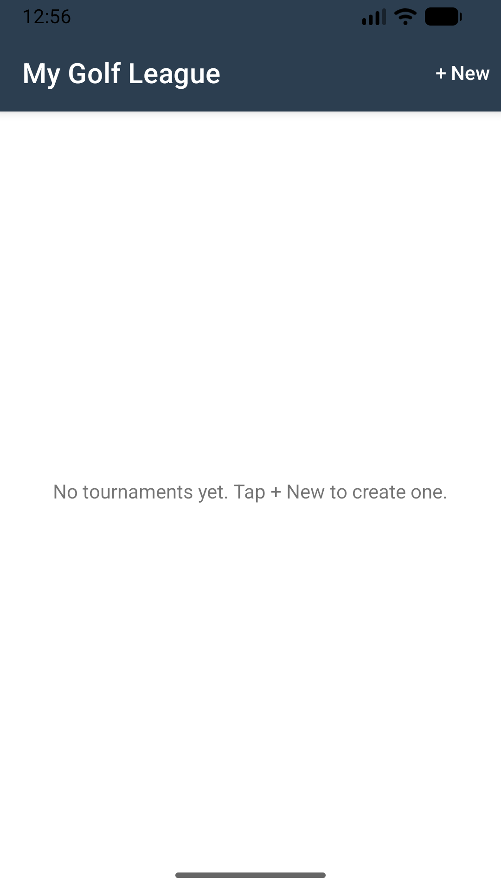
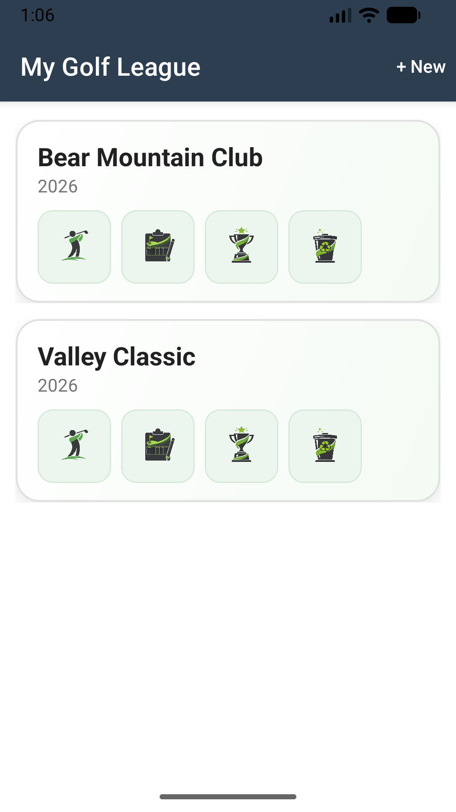
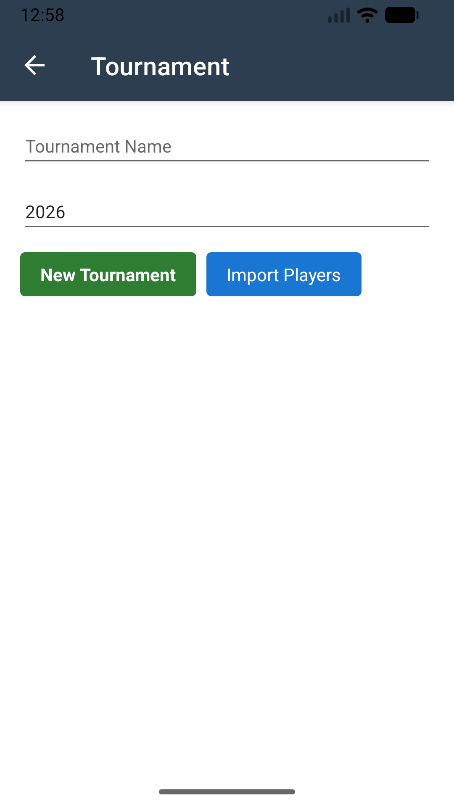
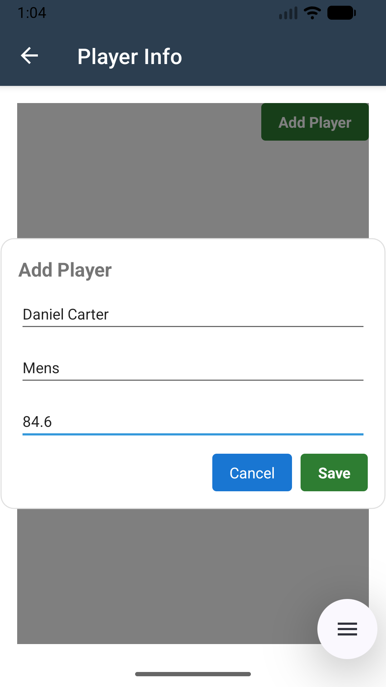
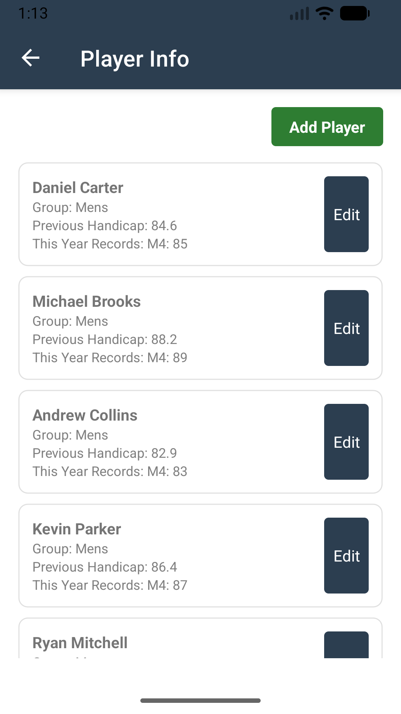
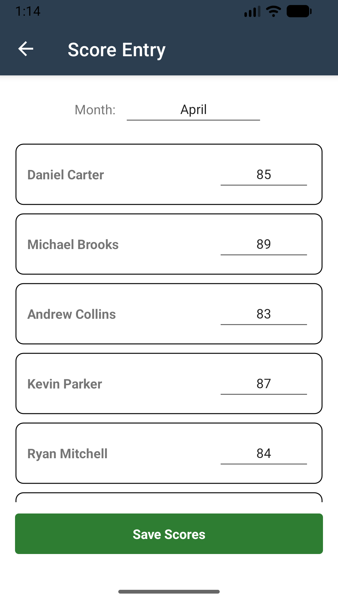
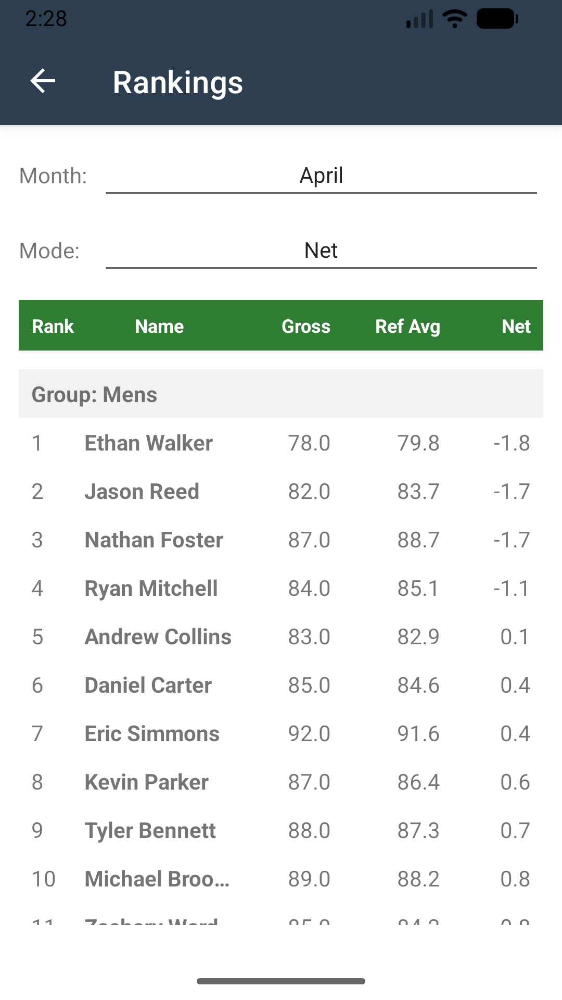

# My Golf League 사용자 매뉴얼 (한국어)

## 1. 앱 개요
My Golf League는 연도별 골프 대회를 관리하고, 월별 점수를 입력하며, 랭킹을 확인하는 모바일 앱입니다.

## 2. 주요 기능
- 대회 생성 및 관리
- 선수 추가 및 수정
- 월별 스코어 입력
- Gross/Net 모드 랭킹 확인

## 3. 주의사항
- 앱 데이터는 휴대폰의 파일로 저장됩니다.
- 앱을 삭제하면 저장된 데이터가 모두 영구적으로 삭제됩니다.

## 4. 화면별 사용법

### 4.1 홈 화면
- `+ New`를 눌러 새 대회를 생성합니다.
- 생성된 대회는 카드 형태로 표시됩니다.

### 4.2 대회 생성
- `Tournament Name`과 `Year`를 입력합니다.
- `New Tournament`: 빈 선수 목록으로 새 대회 생성
- `Import Players`: 이전 연도 데이터가 있으면 선수 정보를 불러와 생성

### 4.3 선수 관리
- `Add Player`로 선수를 추가합니다.
- 선수 이름, 그룹, 전년도 핸디캡(평균)을 입력합니다.
- 선수 카드의 `Edit` 버튼으로 정보를 수정할 수 있습니다.

### 4.4 스코어 입력
- 월(`Month`)을 선택합니다.
- 선수별 점수를 입력합니다.
- `Save Scores`를 눌러 저장합니다.

### 4.5 랭킹 확인
- 월과 모드(`Gross` 또는 `Net`)를 선택합니다.
- `Gross`: 타수가 낮을수록 상위
- `Net`: 실제 점수와 기준 평균(Ref Avg)의 차이로 정렬

## 5. 기본 사용 순서
1. 홈에서 대회를 생성합니다.
2. `Player Info`에서 선수를 등록합니다.
3. `Score Entry`에서 월별 점수를 저장합니다.
4. `Rankings`에서 결과를 확인합니다.

## 6. 참고 사항
- 대회 데이터는 앱 내부 저장소에 JSON 파일로 저장됩니다.
- 점수 입력을 비우면 해당 월 점수는 삭제됩니다.
- Net 랭킹은 기준값이 없는 선수(월/데이터 조건)에 대해 제외 처리될 수 있습니다.

## 7. 평균 핸디(기준 평균) 계산 방법 상세
Net 모드에서는 선수별 `기준 평균(Ref Avg)`을 매월 동적으로 계산합니다.

### 7.1 계산 공식
`RefAvg(해당 월) = (전년도 평균 + 이전에 입력된 월 점수 합) / (이전에 입력된 월 수 + 1)`

`Net = 이번 달 Gross 점수 - RefAvg`

### 7.2 단계별 예시
- 전년도 평균: `84.6`
- 4월 점수(첫 입력 월): `85.0`
- 5월 점수: `82.0`

4월 계산:
- 이전 입력 월 없음
- `RefAvg = (84.6 + 0) / (0 + 1) = 84.6`
- `Net = 85.0 - 84.6 = +0.4`

5월 계산:
- 이전 입력 월 점수: 4월 `85.0`
- `RefAvg = (84.6 + 85.0) / (1 + 1) = 84.8`
- `Net = 82.0 - 84.8 = -2.8`

### 7.3 신규 선수 처리 규칙
- 전년도 평균(`LastYearAverage`)이 없는 선수는 첫 입력 월에 `Ref Avg`를 계산할 수 없습니다.
- 이 경우 해당 월 Net 랭킹에서 제외될 수 있습니다.
